# Reinforcement Learning

## Lecture 1 

Just breifly in Types of NN -> 

### CNN

This neural network works by essentially chunking up the image into features and feed each feature into the neural network at the same time. This means that it is able to recognise patterns in the data that traditional neural networks would not. This is why, for example, a CNN is able to capture a dog, even though the nose could be in a totally different part of the pictures.

Here is the dataset for handwriting from Kaggle:

https://www.kaggle.com/datasets/landlord/handwriting-recognition

### LSTM

Long-Short-Term-Memory, I have covered these before with time series analysis. But essentially you feed the network a chunk of values before t-1, maybe t-2 -> t-10. This means the neural network will look for patterns over ten iterations of data. 

### RL learning Algorithms

There are a few algorithms and concepts we need to cover when talking about RL. Most of this information comes from Sutton and Bardo's book on reinforecement learning. 

This figure shows the reinforcement learning loop. Uppercase indicates random variables whereas lowercase indicatesd calues they can take.

    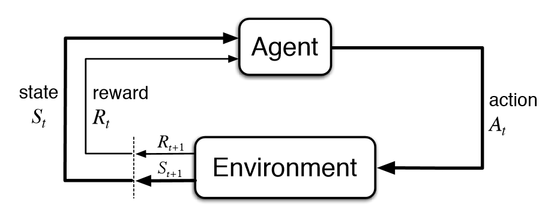

\[ t \in {0,1,2,3} \qquad s \in S  \qquad  a \in A(s) \qquad  r \in R \in \mathbb{R}   \]

\[ P(s',r|s,a) = \mathbb{P}(S_{t+1} = s', R_{t+1} = r | S_t = s, A_t = a) \]

- s is the state, S all possible states
- a is action, A(s) able to take actions based on current s value
- r is reward, R is a sub set of a real number line (i.e. actual numbers and nother else (letters .e.g.))

Probability of next state and reward depends solely on current state and action. It does not depend on the history of actions. This is an assumption called the __Markov Property__. This equation is known as the __Finite Markov Decision Process__. 

The policy function is a probability distribution 

   \[\pi(a|s)\]

For a two action system and state \( s \):
1. The probability of taking action \( a_1 \) is: \( \pi(a_1|s) \)
2. The probability of taking action \( a_2 \) is: \( \pi(a_2|s) = 1 - \pi(a_1|s) \)

If we have five actions, this function will estimate the probability of performing all of these action based on the state. The policy can reccomend a stochastic or deterministic outcome. Why would the machine do this?

1. __Stochastic__: A probability distribution over all possible actions  \[\pi(a|s)\]
2. __Deterministic__: A specific action directly \[\ a = \pi(s)\]

Why would an agent implement some stochatics into the function? 

- __Exploration__: In reinforcement learning, an agent must balance between exploration (trying new things) and exploitation (doing what it currently believes is best). If an agent deterministically always chose the action with the highest probability, it would always be exploiting its current knowledge and might miss out on better strategies. By occasionally choosing actions with lower probabilities, the agent can discover new, potentially better, strategies.

- __Non-Stationary Environments__: Environments can change over time. A strategy that worked previously might not be the best later on. Stochastic policies give the agent flexibility to adapt to such changes.

- __Local Optima__: In the vast space of possible policies, there might be many sub-optimal "local" solutions. Always picking the highest probability action might cause the agent to get stuck in such sub-optimal solutions. Stochasticity helps the agent explore out of these local optima.

The amount of reward that is occured by the policy is known as the __Return__. This is expressed as:

\[ G(t) = \sum_{k=t+1}^{T} \gamma^{k-t-1} R(k) \]

This could be expressed another way. 

\[ G(t) = r(t+1) + \gamma r(t+2) + \gamma^2 r(t+3) + \ldots \]

Essentially this aims to calcualte the reward at each step in the process. As we move further into the process we have a greater discount. [\t] is the current time step you are considering. [\k] iterates over the future time steps where rewards will be received, starting from the next step. __Remember__ that the k=t+1 indicates where k starts from as it iterates by +1. 

So for example let's say you are considering the reward at timestep 1 and you want to calcuate the reward of the 5th step ahead.

\[ k = 5 \]

\[ \gamma^{5 + 1 -1 } R(k) \]

Hence this value for reward would be heavily discounted. Here we have introduced the final time T. There are actually two cases: 

1) The __continum case__: Where agent can continue to work until 
\[ t = \infty\]
2) The __episodic case__: Where agent will stop working until the terminal state (end) at t=T. This makes the end of an episode.

The terminal state = s can also be written as S+. The goal of reinformcement learning is to maxmise the __expected return__. This is expressed as: 

\[ \max_\pi E_{\pi}[G_t] \]

E in this context is the expectation operator. This equation essentially says we want to maximise the cumulative reward over all possible policies. Now, here is the big question. How can we create an agent that will chose a policy that will garner the most reward. Well once way to do this is using the __State Value Function__ and the __Action Value Function__:

### State Value Function

\[ v_\pi(s) = E_{\pi}[G_t|S_t = s] \]

Is very similar to the expected return function. The key difference is that is evaluates this for a given state. Essentially it the cumlative reward generated by given policy in a given state

### Action Value Function

\[ q_\pi(s,a) = E_{\pi}[G_t|S_t = s, A_t = a] \]

Similar to the state value function but takes into account the action. This is the cumulative reward generated by an given policy for a given state and a given action. 

Now our goal in this it to find the optimial policy (potential energy optima). This can be expressed for both the state and action value functions:

\[ v_\pi*(s) \geq v_\pi(s) \]

\[ q_\pi*(s,a) \geq q_\pi(s,a) \]

The key idea, is that these functions provide the agent with the optimal policy for generating the highest reward. There are a few assumptions:

1) The Agent observes St
2) St has the Markoc Property

We sometimes assume:

1) Tabular: All states and actions can be listed
2) Complete Knowlegde: We have complete access to the enviroments dynamics e.g. p(s',r|s,a)

These will be relaxed as we move forward.

## Lecture 2

# Dynamic Programming

Refers to policies which have complete knowledge of the enviroment as a MDP. Here we will use something called the Bellman equation and how it relates to the value function. If we take the example of a block with five different states:

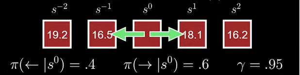

Now there is a 40% chance of the agent going left and a 60% chance of the agent going right. So if we think about this with respect to our state value function:

\[ v_\pi(s^0) = E_{\pi}[G_t|s^0] \]

Now remeber we have two action, left and right. Remeber the law of total probabilty (mutually exclusive events the sum of probabilities is 1);

\[ v_\pi(s^0) = \sum_{a{\leftarrow ,\rightarrow }} \pi(a|s^0)  E_{\pi}[G_t|s^0, a] \]

You'll recognise the last part of this equation has become an action value. Gt is a recursive function. Gt is equal to the reward plut the Gt return function one step later. This is a recursive function. Incase you didn't spot it first time, the Reward is multiplied by gamme -> t=0 which equals (t+1) 1, so the reward for the first step is not discouted by gamma and can be summarised as R(t+1). 

\[ G(t) = \sum_{t+1}^{T} \gamma^{t+1} R(k) \]

\[ E_{\pi}[G_t|s^0] = E_{\pi}[R_{t+1} + \gamma G_{t+1}|s^0, \rightarrow ]  \]

Can be expressed as (by replacing Gt with value function). Now this is a __sneaky__ assumption because:

- G(t) is the __actual__ future reward generated by all future states.
- v(s) is the __expected__ future reward genarated by all future states. 

\[ E_{\pi}[G_t|s^0] = E_{\pi}[R_{t+1} + \gamma v_\pi(S_{t+1})|s^0, \rightarrow ]  \]

So this allows us to move from something to is concrete to something that is calculable. This is where the Bellmnn equation is so powerful. Let's take an actual example. 

- The state values for `s-2` = 19.2, `s-1`=16.5, `s1` = 18.1 and `s2` = 16.2
- The agent has a 40% chance of moving left to `s_{-1}` and a 60% chance to move right to `s_{1}`
- If the agent is in `s_{-1}`, there is a 70% chance it will move to `s_{-2}` and a 30% chance it will stay in `s_{-1}`.
- If the agent is in `s_1`, there is a 50% chance it will move to `s_2` and a 50% chance it will stay in `s_1`.
- The discount factor `γ` is 1, for simplicity, so we don't discount future rewards (which is not typical, but it will simplify our calculation).
- Let's say the immediate reward for moving from `s_0` to `s_{-1}` is 2, and for moving from `s_0` to `s_1` is 1.
- The immediate reward for moving from `s_{-1}` to `s_{-2}` is 0 (because `s_{-2}` already has a high state value, which might represent a terminal state with a large final reward).
- The immediate reward for moving from `s_1` to `s_2` is -1 (perhaps representing a penalty or a less desirable state).

With these immediate rewards, the calculation for the value of `s_0` would now include the rewards:

\[ v(s_0) = P(move left) × (R(to s_{-1}) + P(to s_{-2}) × v(s_{-2}) + P(stay at s_{-1}) × v(s_{-1})) + P(move right) × (R(to s_1) + P(to s_2) × v(s_2) + P(stay at s_1) × v(s_1)) \]

Plugging in the new values and probabilities:

\[ v(s_0) = 0.4 × (2 + 0.7 × 19.2 + 0.3 × 16.5) + 0.6 × (1 + 0.5 × 16.2 + 0.5 × 18.1) \]

Let's calculate each part:
 
\[v(s_0) = 0.4 × (2 + 13.44 + 4.95) + 0.6 × (1 + 8.1 + 9.05) \]
\[v(s_0) = 0.4 × 20.39 + 0.6 × 18.15\]
\[v(s_0) = 8.156 + 10.89\]
\[ v(s_0) = 19.046 \]

So with these made-up immediate rewards and the same transition probabilities as before, the value of `s_0` would now be approximately 19.05. This example shows that you don't need to know the exact rewards of s2 and s-2 to calcualte the value function. Now if we notice the calculation to go left or right has a value of:

\[v(s_0, right) = 10.89\]
\[v(s_0, left) = 8.156 \]

If we were to choose the optimal policy, we would choose right as this gives us the highest state value function and reward. Worth noting there can be mutiple optimal policies if multuple actions lead to the same outcome.

## State vs. Action Values

IN reinforcement learning there are state values and action values. These are two sides of the same coin. Before we deal with the maths let's think about it conceptually:

1) State Value is what we calculated above; it assesses the expected return for being in a particular state and following a certain policy (probabilities of taking various actions.)
2) Action value is more specific; it assesses the expected return of a particular action in a given state. 

\[ v_\pi(s) = \sum_{a \in A} \pi(a|s) \sum_{s', r} p(s', r | s, a) [r + \gamma v_\pi(s')] \]
\[ q_\pi(s, a) = \sum_{s', r} p(s', r | s, a) [r + \gamma \sum_{a' \in A} \pi(a'|s') q_\pi(s', a')] \]

Both equations incorporate the state value function, but they serve different purposes: the first one directly for the state value and the second one indirectly through the action value function, which in turn depends on the state value function of the subsequent state. As an exercise you can have a think about how they are actually related:

\[ v_\pi(s) = \sum_{a \in A} \pi(a|s)q_\pi(s, a) \]

When we are considering the optimal policy, we just make sure that the state value selected is always the maximum possible value. 

## Policy Evaluation & Polucy Improvement

Let's look at an example of the BEllman equation in action.

1) Define the policy and assign random state values
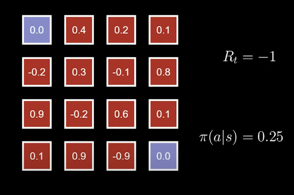

2. Pick a point and compute the state values based on the four potential actions the agent can take (Which in this case is up down left right)
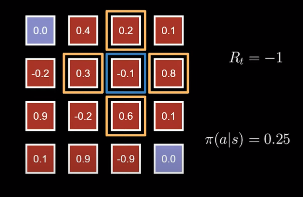

3. Iterate through this many times, and tell the function to stop assessing if the changing values are tiny
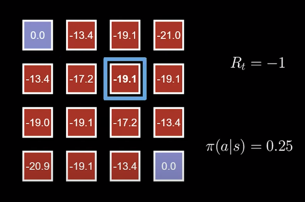

4. Eventually you will have a mapping of state values, this gives a road map for the agent.
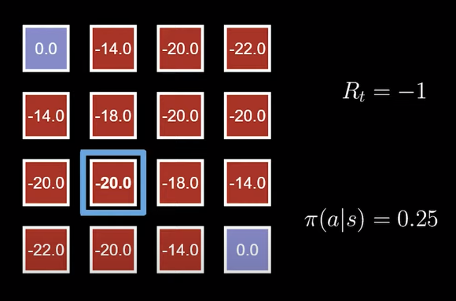

If we set out algoroithmn to be greedy and always want the maximum policy it will then flow to the terminal state 
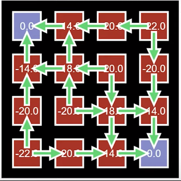

Policy evaluation is the iterative step and policy improvement is the step where we make the agent chose the optimal policy based on these value functions. 

## Generalised Policy Iteration

What reinforcement learning does is this:

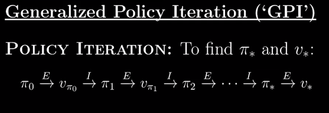

Is optimises the policy and then optimises the value function and then optimises the policy etc. Remeber the value function will change when the policy changes. Over time the algortihmn will  

# Monte Carlo and Off-Policy Methods

We do not know what the next state is going to look like (unlike tabular problems like Gamblers Problem). Worth notings the MC does not estimate MDP functions and process with return as though it's known.

There are two methods in RL: 

- Model-Free - Learn associations between actions and high rewards (such as Pokemon)

- Model-Based - Use a model to plan actions before taking (such as chess)

So instead, we need calculate action values rather than state values. To do this we estimate the value function uses approximations.

\[ V(s) = (1 / C(s))  \sum_{m=1}^{M} \sum_{t=0}^{Tm-1} I[s_t^m = s]g_t^m \]

- C(s) represents the number of times the state is visited. This helps the function balance reward against the number of times a state is visited
- M represents number of episodes, which is a a similation from start to finish
- T the number of timesteps
- I is an indicator function, basically = 1 when the state is the state we are interested in, and = when it isn't
- g represents the return, this is our usual sum of reward over all possible future states. 

This equation calculates the reward contribution of each visit to the stgate in each episode. With C(s) we are trying to balance the reward against the frequency of visits to each state. Let's introduce something called the Update Rule. This is an equation to calculate after each episode what the new value functions are. 

\[ V(s) \leftarrow V(s) + (1 / C(s)) * (G - V(s)) \]

This update quation (G - V) simple calculated the actual reward minus the expected reward. That way the computer will converge on the actual V(s)
Now this equation is good, but having to track all of the states rewards and how many times they are visited is computationally expensive. Instead of 1/C(s) we can use a constant.

\[ V(s) \leftarrow V(s) + α * (G - V(s)) \]

The relative size of learning rate (alpha) can lead to different behaviours:

Large alpha: 

- Faster Initial Learning
- Poorer Convergence

Smaller alpha:

- Slower intial learning
- Improved convergence. 

THere are some benefits to having a constant:

1) Slight reduction in accuracy
2) Can alter convergance rate
3) Reduces computational complexity

You can see here a graph of total reward for a give state of m episodes

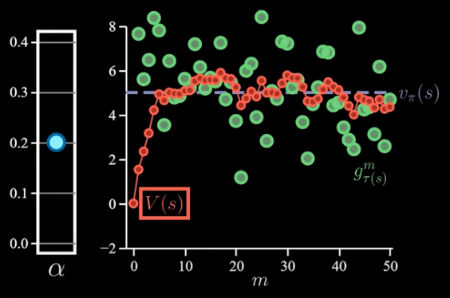

Now if we adjust alpha we can see the V(s) approaches the estimated total reward slower

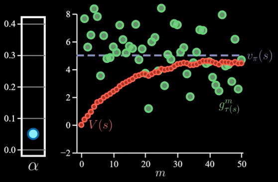

These are only state values, but in RL we want to define the state/action pairs. This is denoted by Q. It essentially the same structure as the value function but for state-action pairs:

So this:

\[ V(s) \leftarrow V(s) + \alpha \cdot \left(G(v) - V(s)\right) \]

\[ G(v) = R(s, a) + \gamma \cdot V(s') \]

Becomes this: 

\[ Q(s, a) \leftarrow Q(s, a) + \alpha \cdot \left(G(q) - Q(s, a)\right) \]

\[ G(q) = R(s, a) + \gamma \cdot \max_{a'} Q(s', a') \]

Q represents the expected return from a given state taking a given action. __You can have multiple q values per state, but only one state value per state__. The little q re[resents short term reward, whereas the big Q represents the cumulative expected reward gained by following a policy]

Exploration-Exploitation Trade-Off is the idea what in order to discover optimal polocies we must explore all state action pairs. But in order to get high returns we have to exploit the state/action pairs that we already know. In order to solve this problem, we use a greedy policy. 

\[ Q(s, a) = (1 - \epsilon) \cdot Q(s, a) + \frac{\epsilon}{|A|} \sum_{a'} Q(s, a') \]

So, once you calcualte all the state-action Q values, you run it through this algorithmn, and then make a decision on which action to take. 

- A represents total number of possible actions
- Calculates the sum of Q-values for all possible actions in state s

A high epsilon value will lead to more exploration and low value focuses on exploiting current knowledge. High values are usually used in early stages of learning, lower values later on. If you go through the maths you will see why. If epsilon = 1 only rely on sum of all potential actions, if epsilon = 0 only rely on actual Q value. Worth noting in some cases this can be expressed as a random action: 

\[ Q(s, a) = (1 - \epsilon) \cdot Q(s, a) + \epsilon*Random Q(s, a') \]

Okay, let's calculate the Q value before we add the greedy algorithmn for the blackjack game. Here is some calcualtions for a given state-action pair.

Consider a scenario where an agent has two actions: __Hit__ and __Stick__. The current estimate for Q(a|s) is 0, the outcomes and their probabilities are as follows:

When it chooses __Hit__:
- Wins 70\% of the time (reward +1)
- Loses 30\% of the time (reward -1)

When it chooses __Stick__:
- Wins 40\% of the time (reward +1)
- Loses 60\% of the time (reward -1)

The agent updates the Q-values using the formula:
\[ Q(s, a) = Q(s, a) + \alpha \times (\text{reward} - Q(s, a)) \]

Applying this formula to the example:

\[ Q(16, 7, \text{True}, H) = 0 + \alpha \times [(0.7 \times 1) + (0.3 \times (-1))] = \alpha \times (0.7 - 0.3) = 0.4 \times \alpha \]

\[ Q(16, 7, \text{True}, S) = 0 + \alpha \times [(0.4 \times 1) + (0.6 \times (-1))] = \alpha \times (0.4 - 0.6) = -0.2 \times \alpha \]

## Off Policy Methods

The difference between on-policy and off-policy:

1) On Policy (Such as Monte Carlo constant alpha) improve the policy as it interacts with the enviroment
2) Off Policy has two seperate policies, the behaviour policy b(a|s) and the target policy pi(a|s).
    - Behaviour policy generates the data
    - Target policy is to be improved or evaluated

In on policy b=pi and in off policy b not = pi. Importance Sampling is a technique used to amend the target policy depending on the behaviour policy. Is it dependant on the ratio of the return from policy pi and policy b

\[  \rho = p_\pi (G_t) / p_b (G_t) \]

If the value for rho is > 1.0 that target policy generates favourable returns, if the value < 1.0 that behaviour policy generates favourable returns. We can then use this equation to calculate the state-action pairs for the target policy by using data from the state policy. 

\[  q_\pi (s,a) = E_b [{p_\pi (G_t) / p_b (G_t)} G(t)|S(t) = s,A_t = a]   \]

\[  q_\pi (s,a) = E_b [\rho * G(t)|S(t) = s,A_t = a]   \]

The agent will follow the behaviour policy, but evaluate for the target policy.

In importance sampling we assume that the behaviour policy has explored every possible state. Ths ratio will boost the state-action values that are relevant to the target policy, this means that although we are exploring with a behaviour policy we are improving the target policy. 

In the case of blackjack, this means the agent will explore the enviroment more, can lead to a more efficient use of experiences as the same episode can provide learning on multiple policies. 

Few things to note:

- Off-Policy are used more when interacting with the enviroment can be more dangerous (self-driving cars). You don't want the agent to interact directly with the enviroment in this state.
- Off-Policy better suited to simulations where we need to learn from historical data, as on-policy is only focused on current iteration.
- On-Policy is simpler and requires less data to run
- Can be better in real time adaption. Because the behaviour policy is not typically updated the on-policy can be better at dealing with real-time change to dynamic enviroment.

## Temporal Differences

Reminder of GPI, generalised Policy Iteration:

- Evaluation: Estimating the Value Function
- Improvement: Policy is updated to improce performacne based on value function

Temporal differences addresses a key component in the evaluation step in Monte Carlo. "An episode must complete before values can be updated." 

If episodes are long it means learning is very slow. We are going to cover n-step Temporal Difference Learning. In constant alpha MC, this is the update function for the Value function:

\[ V(S_t) \leftarrow V(S_t) + \alpha \left( G_t - V(S_t) \right) \]

In n-step TD we replace the actual return (which is also called the target) with a sum of discounted rewards:

\[ V(S_t) \leftarrow V(S_t) + \alpha \left( G_{t:t+n} - V(S_t) \right) \]

\[ G_{t:t+n} = r_{t+1} + \gamma r_{t+2} + \cdots + \gamma^{n-1} r_{t+n} + \gamma^n V(S_{t+n}) \]

In Temporal Difference (TD) learning, specifically in n-step TD methods, the agent updates its value estimates based on rewards obtained over 'n' steps into the future. This approach allows for more frequent updates compared to Monte Carlo methods, which require the completion of an entire episode. In n-step TD:

If n = 1 (one-step TD): The agent updates its value estimate based on the immediate next reward and the estimated value of the subsequent state. This is a more immediate form of learning compared to traditional MC methods.
If n is very large (approaching infinity): The n-step TD method becomes increasingly similar to Monte Carlo methods, as the value updates are based on the cumulative rewards of entire episodes.

The process is this: 

1) The agent takes an action At in a state St based on it's policy. It recieves a reward Rt+1 and moves to St+1
2) This happens for n steps. Then the agent reaches t=n
3) Now the agent has collected a sequence of rewards and it uses these to update the state-value function from n steps ago.
4) This happens iteratively until the terminal state is reached

Don't forget that, V(st) is the current step whereas V(s t+n) is the state n steps into the future. The idea is to update the value of the current state by taking into account the estimated values after n steps. Using the value estimate in the target is called __bootstrapping__.

The n-step TD performs much better that constant alpha MC is predicting expected rewards, even oven batch episodes (the same number of episodes). Here is why: 

1) __More Closely Aligned with MRP__: MRP states that the next state is dependant on the current state and reward. The algorithmns of TD are bootstrapped so use this principle to learn.
2) __Handling Variety__: TD can better handle the variability and stochastic of systems. By updating each step TD can smooth out the noise and variations.
3) __More Efficient Updating__: TD updates every step, so learns much faster
4) __MC just averages returns from states__: MC just takes the average of the return for each state, which is not directly MRP.

MC is can be more robust when system is not strictly MRP, but does fall down more when this assumption holds.  

## On Policy TD Control: n-step SARSA

Now we move conceptually from State values to state-action values:

\[ (S_t) \leftarrow V(S_t) + \alpha \left( G_{t:t+n} - V(S_t)\right) \]

\[ Q(S_t, A_t) \leftarrow Q(S_t, A_t) + \alpha \left( G_{t:t+n} - Q(S_t, A_t)\right) \]

Where:

\[ G_{t:t+n} = R_{t+1} + \gamma R_{t+2} + \cdots + \gamma^{n-1} R_{t+n} + \gamma^n V(S_{t+n}) \]

\[ G_{t:t+n} = R_{t+1} + \gamma R_{t+2} + \cdots + \gamma^{n-1} R_{t+n} + \gamma^n Q(S_{t+n}, A_{t+n}) \]

So why is it called sarsa? Because 1 step involves 

\[ s_t^m , a_t^m,  r_t+1^m,  s_t+1^m, a_t+1^m    \]

The value for n can change output:

- Large n: learn more from a single episode
- Small n: Noisier Updates

## Q-learning

In Q-learning we are making a slight adjustment to TD Control n=1 update ule around the target. Remember that in Q-learning n=1 so we are only one step behind, hence why we are only interested in rewards for st+1:

\[  r_{t+n} + \gamma^n Q(s_{t+n}, a_{t+n}) \]

and changing to this: 

\[  r_{t+n} + \gamma max_a^ Q(s_{t+n}, a_{t+n}) \]

\[ Q(S_t, A_t) = Q(S_t, A_t) + \alpha \left[ R_{t+1} + \gamma \max_a Q(S_{t+1}, a) - Q(S_t, A_t) \right] \]

In normal TD, the agent will follow the same actions as n steps ahead as it is on-policy. However, we have changed it to follow the max state-action value, so it has changed to off-policy. 

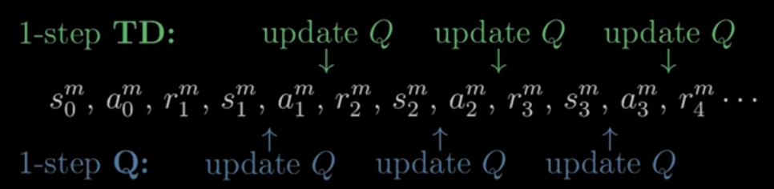

Another way to think about it is when the Q values are updated in the SARSA tuple. The process has changed in Q-learning:

1) The agent takes an action At in a state St based on it's policy. It recieves a reward Rt+1 and moves to St+1
2) The agent will then update the Q-value immediately at t.
3) Once this has been updated agent will take action at+1 which takes the previous state-action pair into account and goes for the highest expected reward.
4) This happens iteratively until the terminal state is reached

The difference is that Q-learning will take the action that leads to the highest expected cumulative reward rather than the policy. 

Whereas TD will take the expected return, which is a weighted average of all possible future rewards.

Therefore Q learning is considered off-policy

## Expected SARSA

Expected SARSA takes Q-learning and adds one additional change to the update rule:

\[
Q(S_t, A_t) \leftarrow Q(S_t, A_t) + \alpha \left[ R_{t+1} + \gamma \sum_{a} \pi(a|S_{t+1}) Q(S_{t+1}, a) - Q(S_t, A_t) \right]
\]

This adjustment means that Expected SARSA calculates the expected value of the next state St+1 summed over all possible actions a weighted by the policy.

__Q-learning (Maximum Q-value)__: In Q-learning, the agent updates its Q-values by always choosing the action with the maximum estimated Q-value in the next state. It is essentially a "greedy" update that assumes the agent will make the best possible decision in the next state. This approach tends to focus on the maximum potential reward.

__Expected SARSA (Weighted Average)__: In Expected SARSA, the agent updates its Q-values by taking a weighted average of all possible actions in the next state, where the weights are based on the probability of selecting each action according to the agent's policy. It accounts for the uncertainty associated with future actions and their associated rewards. This approach is more conservative and reflects the agent's actual policy.

This difference makes SARSA more conservative and closely aligned with agents behaviour policy but also have more randomness. Whereas Q-learning is a more greedy algorithmn and will follow a policy of achieving highest Q-values. 

If we take the cliff walking problem, we can begin to understand why they perform differently. Consider the algorithms

\[ Q(S_t, A_t) \leftarrow Q(S_t, A_t) + \alpha \left[ R_{t+1} + \gamma R_{t+2} + \cdots + \gamma^{n-1} R_{t+n} + \gamma^n Q(S_{t+n}, A_{t+n}) - Q(S_t, A_t)\right] \]

\[
Q(S_t, A_t) \leftarrow Q(S_t, A_t) + \alpha \left[ R_{t+1} + \gamma \sum_{a} \pi(a|S_{t+1}) Q(S_{t+1}, a) - Q(S_t, A_t) \right]
\]

\[ Q(S_t, A_t) \leftarrow  Q(S_t, A_t) + \alpha \left[ R_{t+1} + \gamma \max_a Q(S_{t+1}, a) - Q(S_t, A_t) \right] \]

In the cliff walking example (please look up):

- __SARSA__: Only considers the Q values that are directed by the policy, more deterministic. Therefore, 

- __Expected SARSA__: Considers all possible Q values for all possible decisions, more probabilistic. 

- __Q-Learning__

